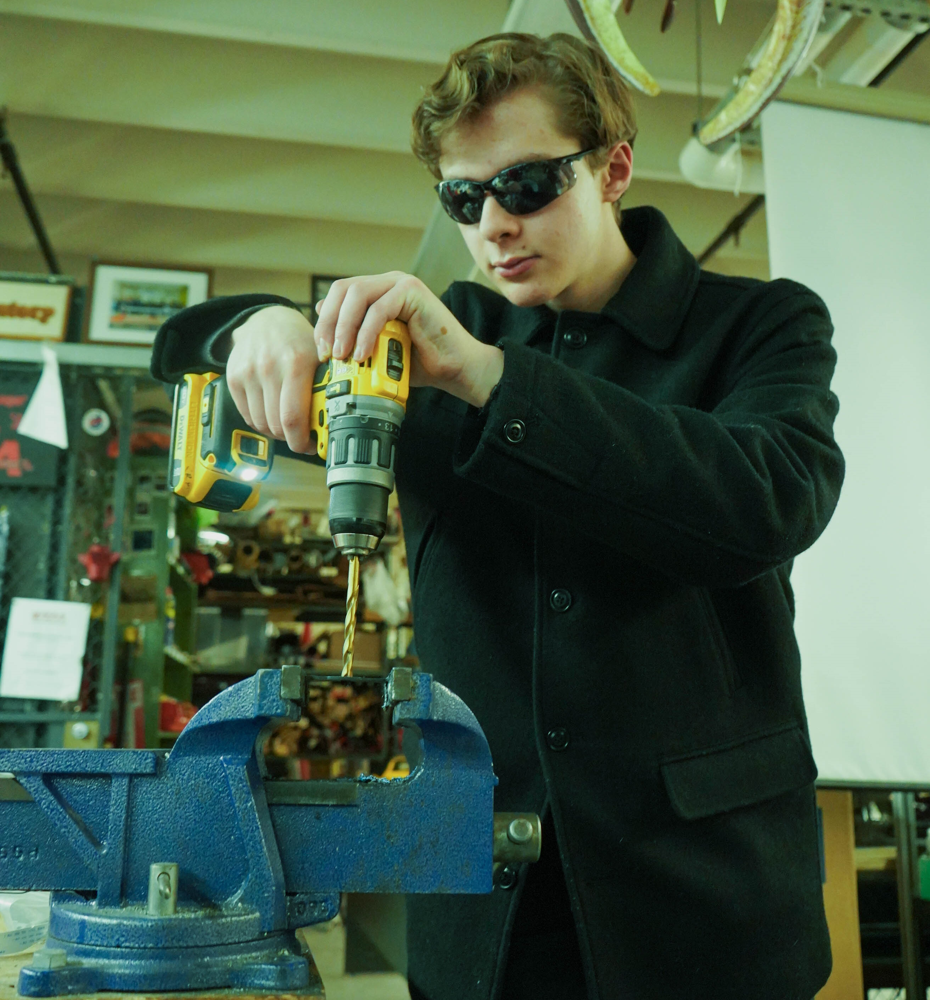

# About me

<h4>

I'm Will C. Forte, a mechanical engineering student and undergraduate researcher.

{.medimg}

<!-- {.smallimg} -->

Since high school, I've been learning the mechanical, electrical, CS, and mathematical principles of robotic systems. The interdisciplinary nature of the field is a great motivator—you can apply almost anything!

## Contact Me

#### If you'd like to discuss any of my projects or just say hello, please contact me at [willcforte@gmail.com](mailto:willcforte@gmail.com). I'm very open to research opportunities and collaboration.

<!-- ## Interests

<h4>

* Robotic simulation (MuJoCo)
* CAD (Onshape/Fusion360)
* Programming and web development (Java/C++, Flutter)
* Technical writing ($\LaTeX$)

</h4> -->

<!--   -->

<!-- #### Check out my [self-study](/self-study) page to see what I'm attempting to learn next. -->

## Experience

<!-- Rutgers Robotics Intern -->

    <h2 class="text-2xl font-semibold inline link">Research Intern, <a href="https://coewww.rutgers.edu/~jgyi/">Rutgers Robotics, Automation, & Mechatronics Lab</a></h2>
    
October 2024 - Present

    <ul class="pl-5 mt-2 space-y-1">
        <li>Conducted literature review on approximating regions of attraction of high-dim. dynamical systems.</li>
        <li>Designed and fabricated the first all-metal chassis for Rutgers’ two-legged robot.</li>
        <li>Reproduced CMU Lidar-based ROS SLAM stack for autonomous quadruped exploration & obstacle avoidance.</li>
    </ul>

<!-- Rutgers Advanced Controls Intern -->

    <h2 class="text-2xl font-semibold inline link">Research Intern, <a href="https://www.laurentburlion.com/">Rutgers Advanced Controls Lab</a></h2>
    
June 2024 - October 2024

    <ul class="pl-5 mt-2 space-y-1">
        <li>Developed low-level quadcopter control architecture in ROS for PX4-MAVROS-Gazebo SITL simulator.</li>
        <li>Created C++ PX4 library with CMake for controlling servos on a tiltrotor quadcopter.</li>
        <li>Self-studied HKUST ELEC5660 course on UAV control theory; assembled UAV platforms.</li>
    </ul>

<!-- NJIT Intern -->

    <h2 class="text-2xl font-semibold inline link">Research Intern, <a href="https://innovative-robotics.github.io/">NJIT Swissler Innovative Robotics Lab</a></h2>
    
June 2023 - June 2024

    <ul class="pl-5 mt-2 space-y-1">
        <li>Developed a robotic arm simulation in MuJoCo (Python) using Jacobian inverse kinematics.</li>
        <li>Programmed ESP32 microcontrollers with ESP-IDF (C++) to run onboard computer vision (OpenCV).</li>
    </ul>

<!-- Education -->
<!-- 

    <h2 class="text-2xl font-semibold">Education</h2>
    
Rutgers University–New Brunswick

    <ul class="list-disc pl-5 mt-2 space-y-1">
        <li>Engineering Honors Academy Scholar (top 50 incoming engineering students).</li>
        <li>Researcher at Robotics and Automation Lab; Hardware Team Member at RUAutonomous.</li>
        <li>Relevant Coursework: Honors Linear Algebra, Honors Calculus III, CAD, Leadership Comm.</li>
    </ul>
    <i>Academy of Math, Science, and Engineering, Rockaway, NJ</i>
    <ul class="list-disc pl-5 mt-2 space-y-1">
        <li>3.97 GPA; 1550 SAT (99th+ percentile).</li>
        <li>Completed 4-year CAD/product development curriculum, FTC robotics, and robotics independent study.</li>
    </ul>

 -->

<!-- EDUCATION -->

Rutgers Univ.—New Brunswick, projected '27
 
<i>B.S. Mechanical Engineering</i>
 
<i>Minor in Mathematics</i>
 
Engineering Honors Academy Scholar

<!-- EDUCATION -->

Academy for Math, Science, & Eng., c.o. '24
 
<i>High School Dipolma</i>
 
4-Year CAD/Engineering Curriculum
 
Adv. Robotics Independent Study Program

<!-- ## Links

<h4>

* [LinkedIn](https://www.linkedin.com/in/willcforte/)
* [GitHub](https://github.com/willcforte)
* [Instagram](https://www.instagram.com/willcforte/) (Nothing Yet)
* [YouTube](https://www.youtube.com/@willcforte) (Nothing Yet)

</h4> -->

## About GTWeb

#### My website GTWeb started as a log for my senior-year high school robotics program. Now, it's a platform to share my passions and work on fun projects.

### Tech Stack

<h4>

My website was built using [Nuxt 3](https://nuxt.com/blog/v3), an open source Javascript library that combines the server-side rendering and static site generation of [Next.js](https://nextjs.org/) with [Vue.js](https://vuejs.org/), whose logical syntax I admire.

 

The text of the website, written in [Markdown](https://en.wikipedia.org/wiki/Markdown) that has [$\KaTeX$](https://katex.org/), HTML, and Vue support, is interpreted by [Nuxt Content](https://content.nuxtjs.org/). Styling is done via [Tailwind CSS](https://tailwindcss.com/).

</h4>

</h4>

<h4 class="centerelement flex-col">

{.medimg .aspect-auto}

@ <a href="https://aiaa.rutgers.edu/ruautonomous.html">RUAutonomous</a>, drilling carbon fiber plates (photo by Will Carney)

</h4>
