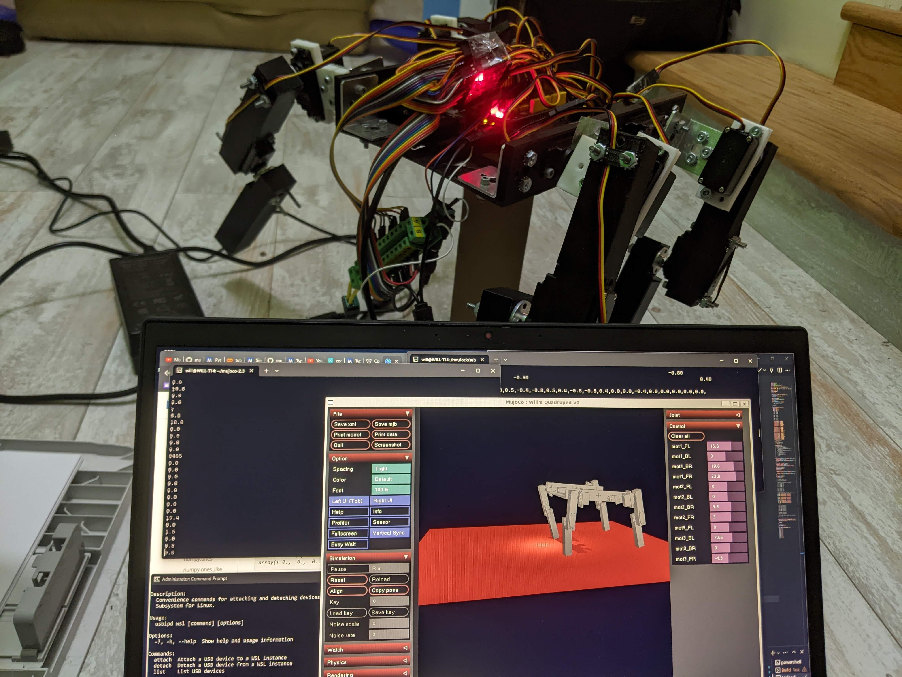
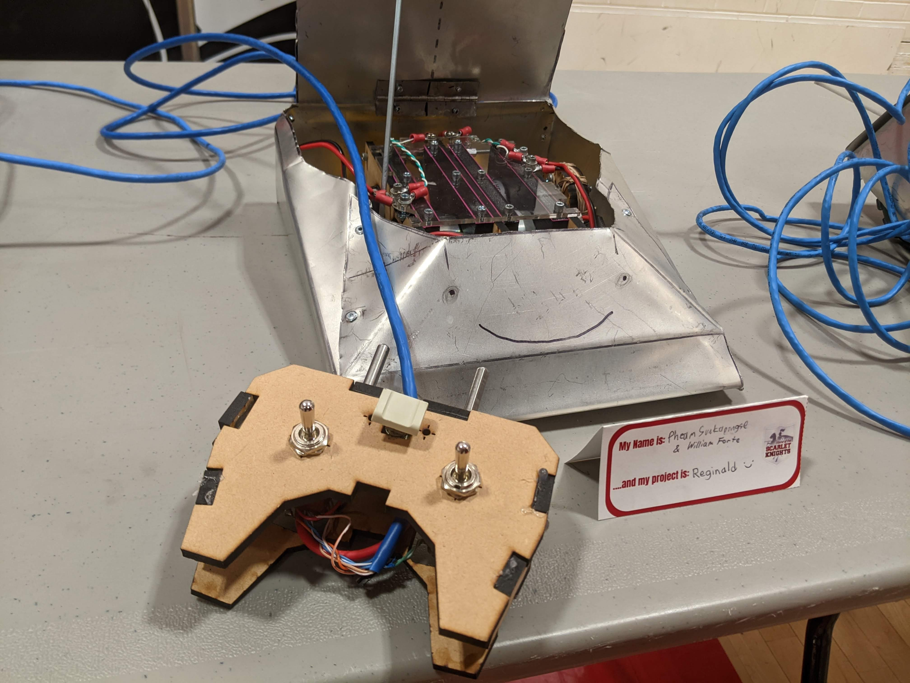

## Gallery

#### Recently, I got an 11-year-old DSLR to learn [photography](/photography).

    <!--  -->

### Fully-Actuated Quadruped v4 - [Project Page](/robotics/quadruped) (2024)

    

### Fully-Actuated Quadruped v1 - [Project Page](/robotics/quadruped) (2024)

    

### Fully-MDF Laser-Cut Claw (2023)

    

### Sumo Bot Chassis Prototype (2023)

