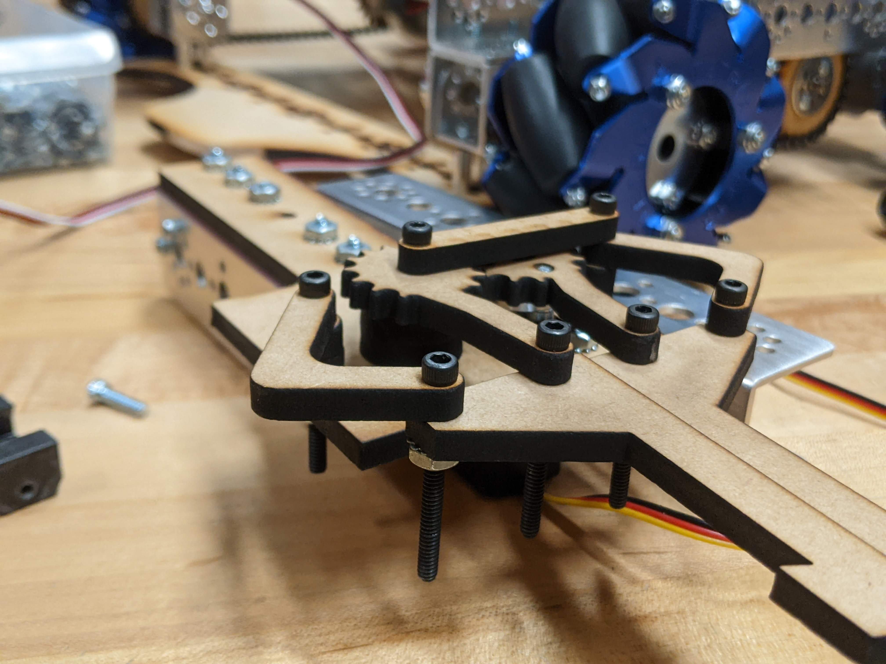

## Gallery

Recently, I got an 11-year-old [Canon EOS 60D](https://en.wikipedia.org/wiki/Canon_EOS_60D) DSLR with which to learn photography and document my engineering projects. This decision was inspired by the photography of MIT D-Lab engineer [Aditya Mehrotra](https://www.adim.io/adventures).

#### Also check out my [photography](/photography) page.

    <!--  -->

### Fully-Actuated Quadruped v4 - [Project Page](/robotics/quadruped)

    

### Fully-Actuated Quadruped v1 - [Project Page](/robotics/quadruped)

    

### Laser-Cut MDF Claw v3 - [Article](/articles_todo/intake)

    

### Sumo Bot Chassis Prototype w/ Custom Wheels