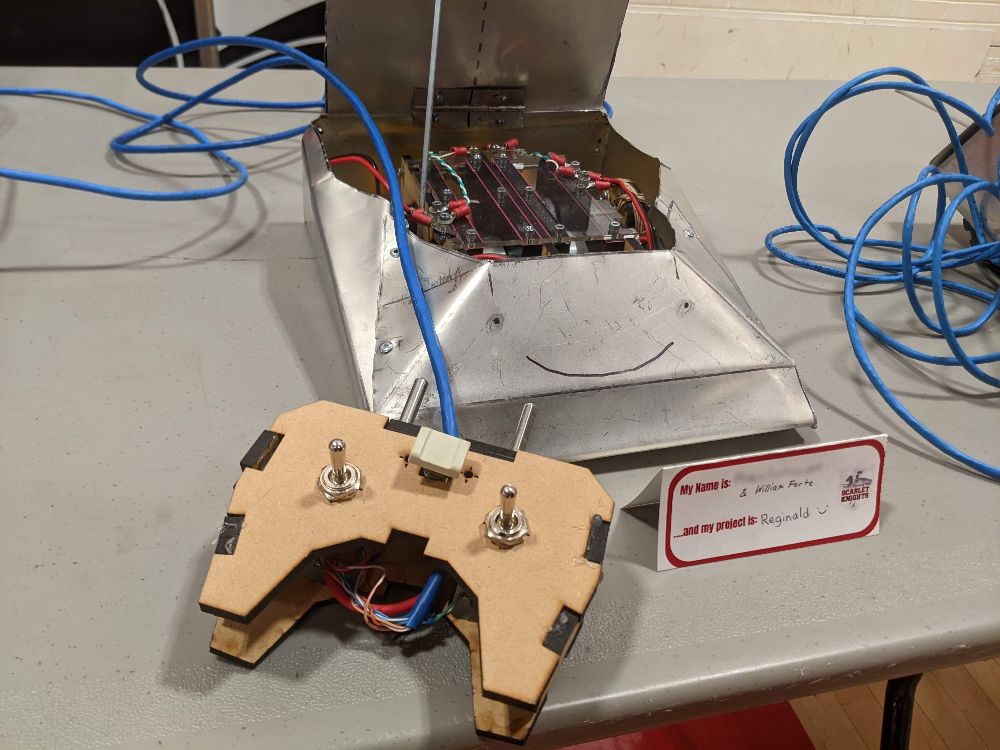

## Gallery

#### Some images from recent projects!

    <!--  -->

### Fully-Actuated Quadruped v4 - [Project Page](/robotics/quadruped)

    

### Fully-Actuated Quadruped v1 - [Project Page](/robotics/quadruped)

    

### Laser-Cut MDF Claw v3 - [Article](/articles_todo/intake)

    

### Sumo Bot Chassis Prototype w/ Custom Wheels