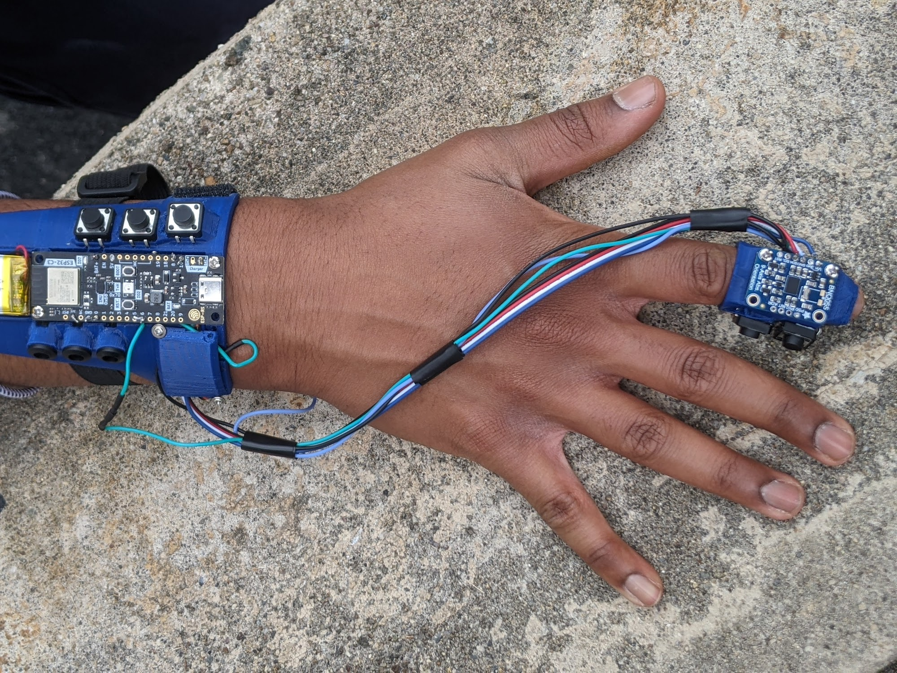

<!-- HERO -->

  
  

    <h2 class="mt-0 mb-4 text-2xl sm:text-4xl lg:text-4xl font-bold leading-snug">
      I'm 
      Will C. Forte, 
      a mechanical engineer and roboticist.
    </h2>
    <h3 class="text-lg sm:text-xl lg:text-2xl font-semibold my-2 leading-normal">
      <i>Welcome to my self-coded project site!</i>
    </h3>
    

        <!-- Buttons -->
        <a href="https://drive.google.com/file/d/1Uf2RytHrNRkymPpMhP9idvtKGz7SBS4J/view?usp=sharing" 
           class="bg-black text-cream space px-4 py-2 text-lg sm:text-xl shadow-xl hover:bg-green-900 whitespace-nowrap">
          <i class="fa-solid fa-file-pdf"></i> CV
        </a>
        <a href="https://www.linkedin.com/in/willcforte/" 
           class="bg-black text-cream space px-4 py-2 text-lg sm:text-xl shadow-xl hover:bg-green-900 whitespace-nowrap">
          <i class="fa-brands fa-linkedin"></i>
        </a>
        <a href="mailto:willcforte@gmail.com" 
           class="bg-black text-cream space px-4 py-2 text-lg sm:text-xl shadow-xl hover:bg-green-900 whitespace-nowrap">
          <i class="fa-solid fa-paper-plane"></i> Contact me!
        </a>
        <a href="/articles" 
           class="bg-black text-cream space px-4 py-2 text-lg sm:text-xl shadow-xl hover:bg-green-900 whitespace-nowrap">
          <i class="fa-solid fa-square-rss"></i> Blog
        </a>
    

  

<!-- SMALL DESCRIPTION -->

  <h3 class="text-lg">
    I study at Rutgers Univ., where I am a member of the Robotics, Automation, & Mechatronics Lab under 
    <a href="https://coewww.rutgers.edu/~jgyi/">Jingang Yi</a>.
  </h3>

<!-- FEATURED PROJECTS -->

<h3 class="mb-4"><a href="/robotics/quadruped">Featured Project: DIY 12-Motor Quadruped</a></h3>

    
    

        

        The summer after junior year of HS, I built a low-cost, 12-motor quadrupedal robot intended to increase the accessibility of advanced robotics to educators and students already participating in FTC Robotics.
        

        <a href="/robotics/quadruped" class="bg-black text-cream px-4 py-2 text-2xl shadow-xl hover:bg-green-900 ml-0 md:ml-2 whitespace-nowrap">
        View Project <i class="fa-sharp fa-solid fa-chevron-right"></i>
        </a>
    

 

<h3 class="mb-4"><a href="/robotics/cufflink">Cuff-Link: An Electromyographic Input Device</a></h3>

    
    

        

        The Cuff-Link™ allows amputees and those suffering from nerve damage to control a computer using nothing but the muscles in their arm. A similar design cost Meta <a href="https://www.theverge.com/2019/9/23/20881032/facebook-ctrl-labs-acquisition-neural-interface-armband-ar-vr-deal">$500 million</a>. It cost us $150.
         
         
        We presented the project in front of a crowd of 200+ at the Academy of Math, Science, & Engineering 2024 Showcase.
        

        <a href="/robotics/cufflink" class="bg-black text-cream px-4 py-2 text-2xl shadow-xl hover:bg-green-900 ml-0 md:ml-2 whitespace-nowrap">
        Read the Proposal <i class="fa-sharp fa-solid fa-chevron-right"></i>
        </a>
    

 

<h3 class="mb-4"><a href="https://tubaa.dev/">TUBAA: Aeroacoustic Analysis of the MIT Toroidal Propeller</a></h3>

    
    

        

        I was the CFD lead of a large undergraduate research project in which we compared the aeroacoustics of the MIT Lincoln Lab toroidal propeller against traditional alternatives using ANSYS Fluent and FFT spectra. We are planning to submit the manuscript for conference publication.
        

        <a href="https://tubaa.dev/" class="bg-black text-cream px-4 py-2 text-2xl shadow-xl hover:bg-green-900 ml-0 md:ml-2 whitespace-nowrap">
        Visit Our Website <i class="fa-sharp fa-solid fa-chevron-right"></i>
        </a>
    

 

<!-- EDUCATION -->

Rutgers University—New Brunswick, c.o. '27
 
<i>B.S. Mechanical Engineering</i>
 
<i>Minor in Mathematics</i>
 
Engineering Honors Academy Scholar

 
 
 

<!-- CALLS TO ACTION -->

  <a href="/articles" class="bg-black text-white px-6 py-3 text-xl space italic shadow-xl hover:bg-gray-800 inline-block mb-4">
    View all blog posts <i class="fa-solid fa-arrow-right"></i>
  </a>
   
  <a href="/robotics" class="bg-black text-white px-6 py-3 text-xl space italic shadow-xl hover:bg-gray-800 inline-block">
    Robotics engineering logs <i class="fa-solid fa-arrow-right"></i>
  </a>

 

<!-- <h3><a href="/robotics/quadruped">Electromyography Assitive Device: The Cuff-Link</a></h3> -->
<!-- <h4>LCFAQ: Low-Cost Fully-Actuated Quadruped</h4> -->

<!-- 

    

        
    

    

        
The summer after junior year of HS, I built a low-cost, 12-motor quadrupedal robot intended to increase the accessibility of advanced robotics to educators and students already participating in FTC Robotics.

        <a href="/robotics/quadruped">
View Project <i  class="fa-sharp fa-solid fa-chevron-right"></i>
</a>
    

 -->

<!-- ### [Featured Project: DIY Quadruped Prototype](/robotics/quadruped) -->

<!-- <a href="/robotics/quadruped">{.img .border-black .border-r-8 .border-b-8}</a> -->

<!-- Over the summer of '23, I developed this robot with 12 servos, fully-actuated legs, and spare FTC parts from my teacher. It is controlled with the MuJoCo physics simulator. -->
