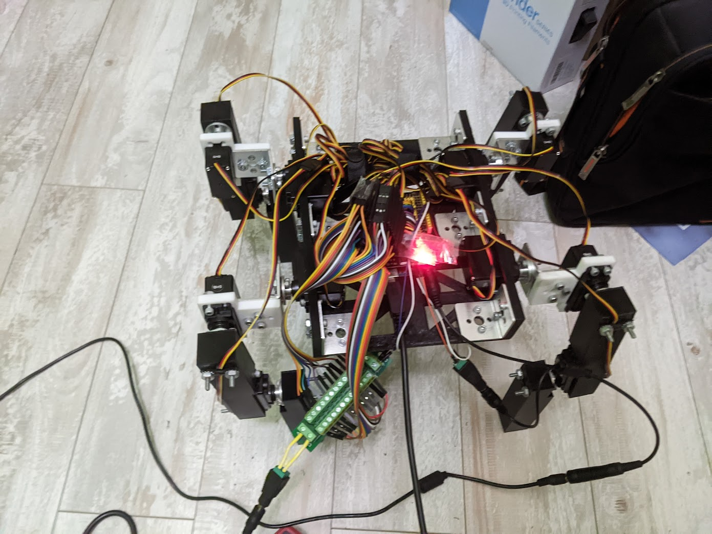

<!-- HERO -->

  
  

    <h2 class="mt-0 mb-4 text-2xl sm:text-4xl lg:text-4xl font-bold leading-snug">
      I'm 
      Will C. Forte, 
      a mechanical & computational roboticist.
    </h2>
    <h3 class="text-lg sm:text-xl lg:text-2xl font-semibold my-2 leading-normal">
      <i>Welcome to my self-coded website!</i>
    </h3>
    

        <!-- Buttons -->
        <a href="https://willcforte.com/pdf/cv25.pdf" 
           class="bg-black text-cream space px-4 py-2 text-lg sm:text-xl shadow-xl hover:bg-green-900 whitespace-nowrap noh">
          <i class="fa-solid fa-file-pdf"></i> CV
        </a>
        <a href="https://www.linkedin.com/in/willcforte/" 
           class="bg-black text-cream space px-4 py-2 text-lg sm:text-xl shadow-xl hover:bg-green-900 whitespace-nowrap noh">
          <i class="fa-brands fa-linkedin"></i>
        </a>
        <a href="https://bsky.app/profile/willcforte.com" 
           class="bg-black text-cream space px-4 py-2 text-lg sm:text-xl shadow-xl hover:bg-green-900 whitespace-nowrap noh">
          <i class="fa-brands fa-bluesky"></i>
        </a>
        <a href="mailto:willcforte@gmail.com" 
           class="bg-black text-cream space px-4 py-2 text-lg sm:text-xl shadow-xl hover:bg-green-900 whitespace-nowrap noh">
          <i class="fa-solid fa-paper-plane"></i> Contact me!
        </a>
        <a href="/articles" 
           class="bg-black text-cream space px-4 py-2 text-lg sm:text-xl shadow-xl hover:bg-green-900 whitespace-nowrap noh">
          <i class="fa-solid fa-square-rss"></i> Blog
        </a>
    

  

  

  <!-- SMALL DESCRIPTION -->
  

    <h3 class="text-lg">
      I'm the President & Founder of <a href="https://rudynamics.vercel.app/" class="yesh">Rutgers Dynamics</a>, an extremely-ambitious student-run robot dog & humanoid lab.
      Part of a collaboration <a href="https://ccbr-humanoid.github.io/wiki/docs/home/" class="yesh">democratizing legged robotics</a> with friends from Caltech, Columbia, Rutgers, and Berkeley.
    </h3>
  

  

  <!-- SMALL DESCRIPTION -->
  

    <h3 class="text-lg">
      I'm an undergrad robotics + AI researcher & Aresty Fellow at Rutgers' Honors College under <a href="https://pracsys.cs.rutgers.edu/" class="yesh">Prof. Kostas Bekris</a>.
       
      Aside from my B.S. in MechE, I was a PI on a <a href="https://www.lspace.asu.edu/proposal-writing-academy" class="yesh">NASA NPWEE</a> grant proposal.
    </h3>
  

<!-- FEATURED PROJECTS -->

<h3 class="mb-4"><a href="/robotics/quadruped" class="yesh">LCFAQ: A Low-Cost, Fully-Actuated Quadruped</a> (2023)</h3>

    
    

        

        The summer after junior year of HS, I used spare parts to built a low-cost (≈$500), 12-motor quadrupedal robot intended to increase the accessibility of advanced robotics to educators and students already participating in FTC Robotics.
        

        <a href="/robotics/quadruped" class="bg-black text-cream px-4 py-2 text-2xl shadow-xl hover:bg-green-900 ml-0 md:ml-2 whitespace-nowrap noh">
        View Project <i class="fa-sharp fa-solid fa-chevron-right"></i>
        </a>
    

 

<h3 class="mb-4"><a href="/robotics/cufflink" class="yesh">Cuff-Link: An Electromyographic Input Device</a> (2024)</h3>

    
    

        

        The Cuff-Link™ allows amputees and those suffering from nerve damage to control a computer using nothing but the muscles in their arm. A similar design cost Meta <a href="https://www.theverge.com/2019/9/23/20881032/facebook-ctrl-labs-acquisition-neural-interface-armband-ar-vr-deal">$500 million</a>. It cost us $150.
         
         
        We presented the project in front of a crowd of 200+ at the Academy of Math, Science, & Engineering 2024 Showcase.
        

        <a href="/robotics/cufflink" class="bg-black text-cream px-4 py-2 text-2xl shadow-xl hover:bg-green-900 ml-0 md:ml-2 whitespace-nowrap noh">
        Read the Proposal <i class="fa-sharp fa-solid fa-chevron-right"></i>
        </a>
    

 

<h3 class="mb-4"><a href="https://tubaa.dev/" class="yesh">TUBAA: Aeroacoustic Analysis of the MIT Toroidal Propeller</a> (2023)</h3>

    
    

        

        I was the CFD lead of a large undergraduate research project in which we compared the aeroacoustics of the MIT Lincoln Lab toroidal propeller against traditional alternatives using ANSYS Fluent and FFT spectra. The manuscript is available on arXiv.
        

        <a href="https://tubaa.dev/" class="bg-black text-cream px-4 py-2 text-2xl shadow-xl hover:bg-green-900 ml-0 md:ml-2 whitespace-nowrap noh">
        Visit Our Website <i class="fa-sharp fa-solid fa-chevron-right"></i>
        </a>
    

 

<h3 class="mb-4"><a href="https://www.youtube.com/embed/h3W5pSzrWO8" class="yesh">MuJoCo Simulator Tutorial</a></h3>

    <iframe width="560" height="315" 
        src="https://www.youtube.com/embed/h3W5pSzrWO8" 
        title="YouTube video player" 
        frameborder="0" 
        allow="accelerometer; autoplay; clipboard-write; encrypted-media; gyroscope; picture-in-picture; web-share" 
        allowfullscreen
        class="w-full sm:w-3/4 md:w-4/5 lg:w-3/4 xl:w-2/3 max-w-6xl min-w-[28rem] border-black border-r-8 border-b-8">
    </iframe>
    

        

        I gave a workshop at the Rutgers University <a href="https://robotics.rutgers.edu/pages/n2e_robotics.html" class="yesh">N2E Robotics Club</a> to share my enthusiasm for the MuJoCo simulator and help people build and control a 2R manipulator using PID control.
        

        <a href="https://www.youtube.com/embed/h3W5pSzrWO8" class="bg-black text-cream px-4 py-2 text-2xl shadow-xl hover:bg-green-900 ml-0 md:ml-2 whitespace-nowrap noh">
        Watch Video <i class="fa-sharp fa-solid fa-chevron-right"></i>
        </a>
    

 

<!-- EDUCATION -->

<!-- Rutgers University—New Brunswick, c.o. '27 -->
Rutgers University—New Brunswick
 
<i>B.S. Mechanical Engineering</i>
 
<i>Minors in Computer Science & Mathematics</i>
 
Engineering Honors Academy Scholar

 
 

<!-- CALLS TO ACTION -->
If you want to say hi or talk robotics, email me at willcforte@gmail.com.

<!-- 

  <a href="/articles" class="bg-black text-white px-6 py-3 text-xl space italic shadow-xl hover:bg-gray-800 inline-block mb-4 noh">
    View all blog posts <i class="fa-solid fa-arrow-right"></i>
  </a>
   
  <a href="/robotics" class="bg-black text-white px-6 py-3 text-xl space italic shadow-xl hover:bg-gray-800 inline-block noh">
    Robotics engineering logs <i class="fa-solid fa-arrow-right"></i>
  </a>

 -->

 

<!-- <h3><a href="/robotics/quadruped">Electromyography Assitive Device: The Cuff-Link</a></h3> -->
<!-- <h4>LCFAQ: Low-Cost Fully-Actuated Quadruped</h4> -->

<!-- 

    

        
    

    

        
The summer after junior year of HS, I built a low-cost, 12-motor quadrupedal robot intended to increase the accessibility of advanced robotics to educators and students already participating in FTC Robotics.

        <a href="/robotics/quadruped">
View Project <i  class="fa-sharp fa-solid fa-chevron-right"></i>
</a>
    

 -->

<!-- ### [Featured Project: DIY Quadruped Prototype](/robotics/quadruped) -->

<!-- <a href="/robotics/quadruped">{.img .border-black .border-r-8 .border-b-8}</a> -->

<!-- Over the summer of '23, I developed this robot with 12 servos, fully-actuated legs, and spare FTC parts from my teacher. It is controlled with the MuJoCo physics simulator. -->
