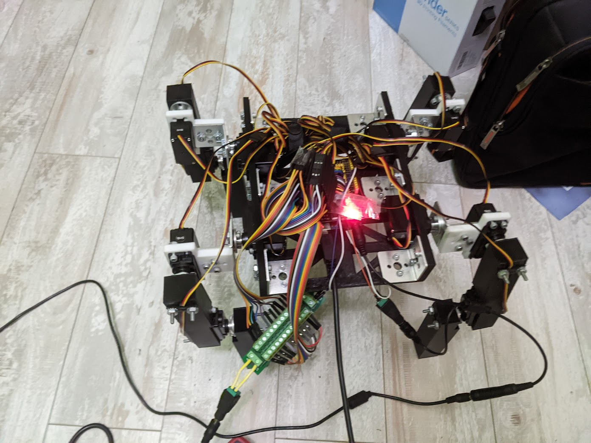

<!-- visible sm:invisible sm:w-0 sm:h-0 sm:border-r-0 sm:border-b-0 -->

## <h2 class="mt-0 mb-0 zeromt">I'm 
Will C. Forte
, a mechanical engineer and roboticist.</h2>

### <h3 class="my-0 mb-4">*Welcome to my self-coded project site!*</h3>

    <a href="https://drive.google.com/file/d/1Uf2RytHrNRkymPpMhP9idvtKGz7SBS4J/view?usp=sharing">
<i  class="fa-solid fa-file-pdf"></i> CV
</a>
    <a href="https://www.linkedin.com/in/willcforte/">
<i  class="fa-brands fa-linkedin"></i>
</a>
    <a href="mailto:willcforte@gmail.com">
<i  class="fa-solid fa-paper-plane"></i> Contact me!
</a>
    <a href="mailto:willcforte@gmail.com">
<i  class="fa-solid fa-paper-plane"></i>
</a>
    <a href="/articles">
<i  class="fa-solid fa-square-rss"></i> Blog
</a>

#### I study at Rutgers University, where am a member of the Robotics, Automation, & Mechatronics Lab under 
<a href="https://coewww.rutgers.edu/~jgyi/">Jingang Yi</a>
.

 

        

            <h3><a href="/robotics/quadruped">Featured Project: DIY 12-Motor Quadruped</a></h3>
            <h4>LCFAQ: Low-Cost Fully-Actuated Quadruped</h4>
            
The LCFAQ is a low-cost quadrupedal robot intended to increase the accessibility of advanced robotics to high school educators and students already participating in FTC Robotics.

            <a href="/robotics/quadruped">
View Project <i  class="fa-sharp fa-solid fa-chevron-right"></i>
</a>
        

        

            
        

    

<!-- ### [Featured Project: DIY Quadruped Prototype](/robotics/quadruped) -->

<!-- <a href="/robotics/quadruped">{.img .border-black .border-r-8 .border-b-8}</a> -->

<!-- Over the summer of '23, I developed this robot with 12 servos, fully-actuated legs, and spare FTC parts from my teacher. It is controlled with the MuJoCo physics simulator. -->

Rutgers University—New Brunwsick, c.o. '27
 
<i>B.S. Mechanical Engineering</i>
 
<i>Minor in Mathematics</i>
 
Engineering Honors Academy Scholar

 
 

    <a href="/articles" class="nounderline">
        View all blog posts
        <i class="fa-regular fa-file-lines text-white mr-2"></i>
        
 <i class="fa-solid fa-arrow-right"></i> 

    </a>

    <a href="/robotics" class="nounderline">
        Robotics engineering logs
        <i class="fa-regular fa-note-sticky mr-2"></i>
        
 <i class="fa-solid fa-arrow-right"></i> 

    </a>

#### What you can expect to find on this website:

- [Robotics \& CAD GT Program](/robotics)

<!-- ### - [Math w/ $\LaTeX$](/calculus) -->

- [Miscellaneous Articles](/articles)
- [Self-study log](/self-study) (nothing yet)
- [Photography](/photography)