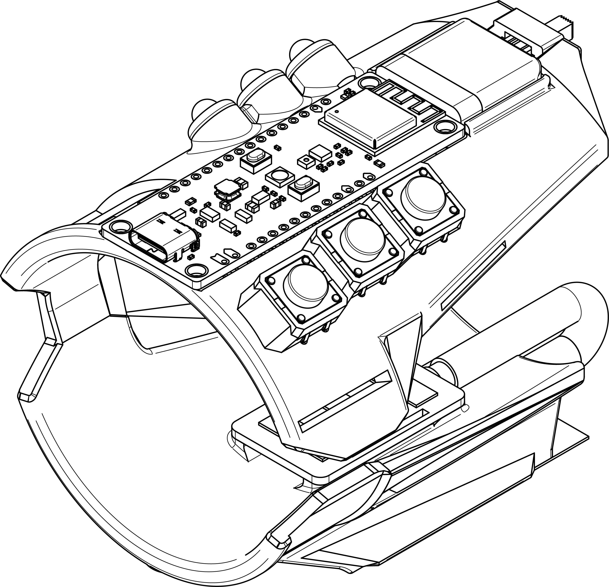

## The Cuff-Link

### An revolution in computer input accessibility

{.img}

 

{.smallimg}

Wrist Module

 

In our senior year of high school, our four-student team presented the Cuff-Link onstage to a crowd of 200+ people during the annual Academy of Math, Science, and Engineering product showcase. It was the culmination of our four-year specialized program in CAD, mechatronics, and product development.

Proposal download link and associated files to be added.

Check out the personal website of my good friend [Nikhil Vijay](https://nkve.dev/index.html), who I collaborated with on this project.
