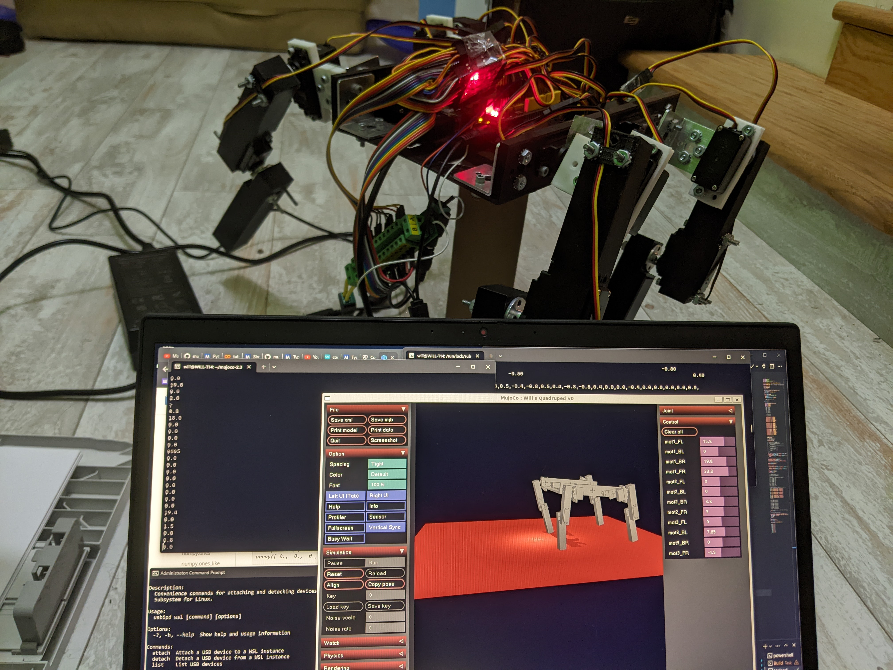

## Fully-Actuated Quadruped

{.img}

Beta Prototype v4

 

As the main project for my robotics independent research study, I am building a fully-actuated quadrupedal robot from low-cost, accessible components.

 

Featuring 12 positional servos and a whopping 15 Amps of current, wiring this was challenge—yet controlling its instablities will be harder.

 

<!-- ### [Beta Schematic](https://drive.google.com/file/d/1bmjf-VGk9M5Y_pPB418Mp6SK6TlWs96h/view?usp=sharing)

### [Beta Schematic (local testlink)](media/quadruped_v1.pdf) -->

### Components

* 12 servo motors, 4 MDF gears
* Arduino microcontroller
* 15A 5V power distribution
* Modeled with MuJoCo physics simulator Python bindings

 

### Purpose

The LCFAQ is meant to serve as a cost-effective (≈$500) introduction to advanced biomimetic robotics for high school educators and students, utilizing accessible components that schools likely already have from FTC Robotics participation. The robot is programmable via an Arduino microcontroller.

While the current prototype does not walk yet, there are many planned improvements to increase the stability of the robot without investing in high-cost servos:

 

* High-torque shoulder gears (Done)
* Shorter chassis width
* High-friction feet

 

### Control

The LCFAQ uses a novel control loop developed with the MuJoCo robotic physics simulator.

Each individually-addressable joint can be rotated from -π/4 to π/4 using the interactive MuJoCo simulate GUI. Assuming that all joints are correctly calibrated, a live preview will show the current pose of the quadruped.

 

{.img}

 

### Experience

This project allowed me to learn a considerable amount of new skills which I hope to apply to my future engineering projects:

 

* Simulation
* Modeling
* MuJoCo API
* Embedded systems

 

Some more photos:

{.img}

{.img}

 

Beta Prototype:

{.img}