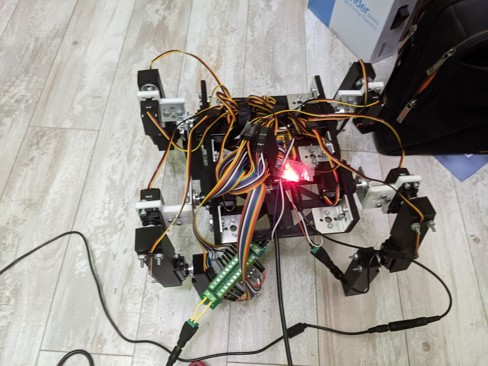

## Fully-Actuated Quadruped

As the main project for my robotics independent research study, I am building a fully-actuated quadrupedal robot from low-cost, accessible components.

 

Featuring 12 positional servos and a whopping 15 Amps of current, wiring this will be a challenge—yet controlling it will be even harder.

 

### [Beta Schematic](https://drive.google.com/file/d/1bmjf-VGk9M5Y_pPB418Mp6SK6TlWs96h/view?usp=sharing)

### [Beta Schematic (local testlink)](media/quadruped_v1.pdf)

 

{.img}

Standing (but not controllable :( ) Beta Prototype

 

Although the beta prototype is terribly cable-managed, I am designing structures atop the chassis to organize the power delivery, along with a custom perforated board mounted on standoffs.
