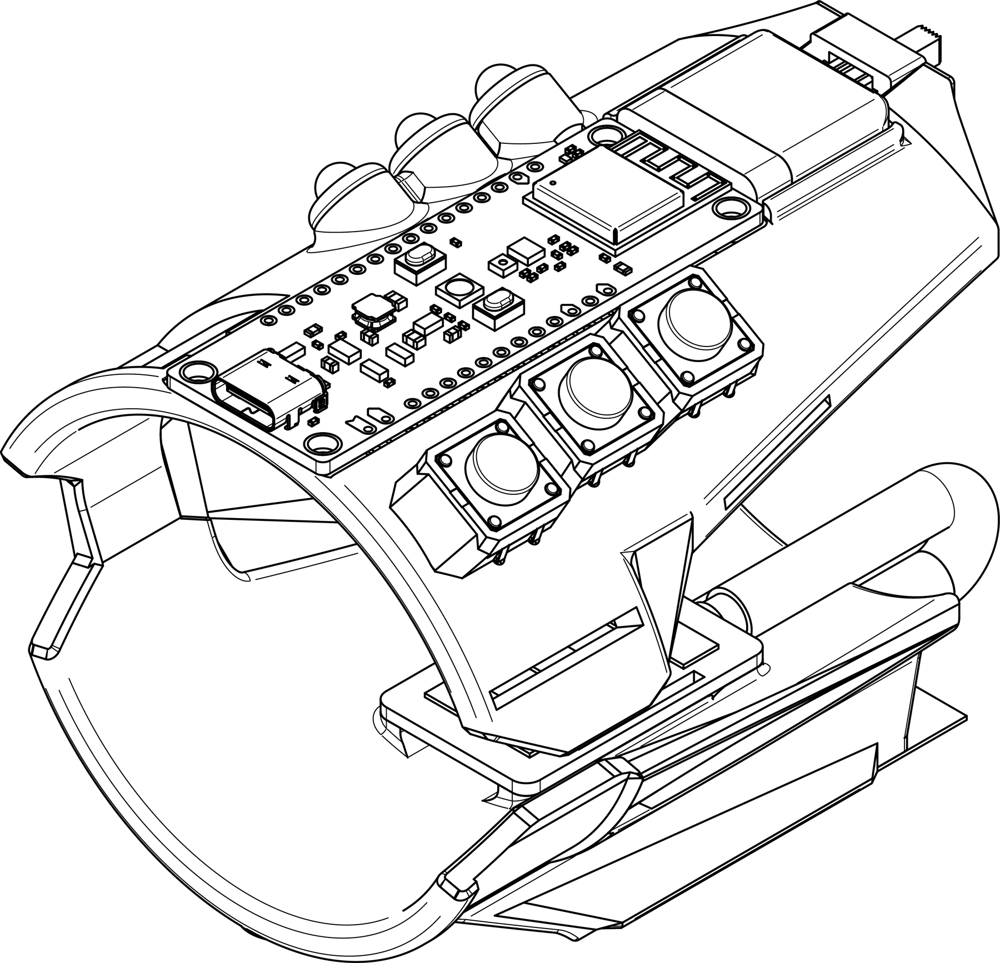

## The Cuff-Link

The Cuff-Link™ allows amputees and those suffering from nerve damage to control a computer using nothing but the muscles in their arm. A similar design cost Meta $500 million. It cost us $150.

### An revolution in computer input accessibility

Wrist Module

In our senior year of high school, our four-student team presented the Cuff-Link onstage to a crowd of 200+ people during the annual Academy of Math, Science, and Engineering product showcase. It was the culmination of our four-year specialized program in CAD, mechatronics, and product development.

Watch the presentation and read associated files below.

Check out the personal website of my good friend [Nikhil Vijay](https://nkve.dev/index.html), whom I collaborated with on this project.

## Invited Talk

_The Cuff-Link Electromyographic Input Device_, The Academy for Math, Science, and Engineering, Academy Senior Showcase, May 2024

[Watch Video](https://drive.google.com/file/d/1SJNabj0U9kuphewD90xxaf7NGrvliWLt/view) [View Slides](https://willcforte.com/pdf/Blue%20Team%20-%20Cuff-Link%20Final%20Presentation%20(Milestone%20%236).pdf)
