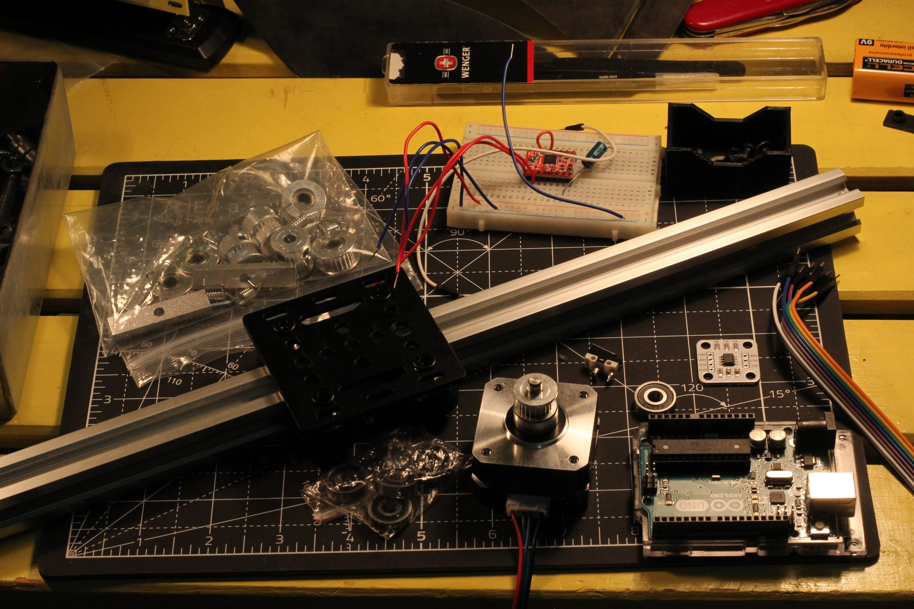

# Inverted Pendulum Project Log #1

Work-in-progress living document

2020 aluminum extrusion gantry & parts

## Inspiration

Having recently studied robotics in greater depth, I wanted to begin a project that would apply my knowledge of control theory--the science of making machinery bend to your will to using sensors and physics.

This led me to the perfect choice--an [inverted pendulum](https://en.wikipedia.org/wiki/Inverted_pendulum). It's a wonderful Renaissance engineering challenge, featuring a bit of everything: mechanical design, motor control, sensors, and simulation.

For inspiration on how to make this happen, I looked to others' previous attempts:

* [Philippe Francois](https://www.youtube.com/playlist?list=PLR8PgRVxI3_eJRzC2vmJDue801VbdpnOU) implemented [CTMS' wonderfully-detailed inverted pendulum model](https://ctms.engin.umich.edu/CTMS/index.php?example=InvertedPendulum&section=SystemModeling).
* Ian Carey (nice site btw) had a very helpful [bill of materials](https://iancarey.ie/projects/invertedpendulum), pointing me to the widely-used GT2 timing belt (same as most 3D printers!) as a drive mechanism.

## Bill of Materials

| Part | Quantity | Link |
|------|----------|------|
| 42x42x23mm Nema 17 Stepper Motor (17HS08-1004S) | 1 | [Amazon](https://www.amazon.com/dp/B07PMWQ21T) |
| A4988 Stepper Motor Driver | 1 | [DigiKey](https://www.digikey.com/en/products/detail/pololu-corporation/1182/10450403) |
| 400mm 2020 Aluminum Extrusion | 1 | [Amazon](https://www.amazon.com/dp/B0CYH2PDFL) |
| 2020 V-Slot Gantry | 1 | [Amazon](https://www.amazon.com/dp/B09B396WH9) |
| AS5600 Magnetic Encoder | 1 | [Amazon](https://www.amazon.com/dp/B09LMB3PTZ) |
| GT2 Timing Belt + Timing Pulley | 1 | [Amazon](https://www.amazon.com/dp/B08SMFM3Z6) |
| 625-2RS Ball Bearing | 2 | [Amazon](https://www.amazon.com/dp/B07TNNX9YX) |
| SPST Limit Switch | 1 | N/A |
| Arduino Uno Rev3 | 1 | [Arduino](https://store.arduino.cc/products/arduino-uno-rev3) |
