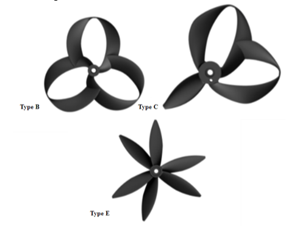

## TUBAA

I was the CFD lead of a large undergraduate research project in which we compared the aeroacoustics of the MIT Lincoln Lab toroidal propeller against traditional alternatives using ANSYS Fluent and FFT spectra. We are planning to submit the manuscript for conference publication.

### Creating less annoying drones for urban applications

I was the CFD lead of an 8-person undergraduate research project in which we compared the aeroacoustics of various propeller designs (including a modified MIT Toroidal Propeller) against traditional alternatives using ANSYS Fluent and FFT spectra. You can read the manuscript on our website:

[Visit Our Website](https://tubaa.dev/)

## Manuscript

### [Toroidal and Uneven Blade Aeroacoustic Analysis (TUBAA)](https://tubaa.dev/) — 2023

Nikhil Vijay\*, **Will C. Forte**\*, Ishan Gajjar\*, Sarvesh Patham\*, Syon Gupta\*, Sahil Shah\*, Prathamesh Trivedi\*, Rishit Arora\*

Mentors: Gao Jun Wu†, Seongkyu Lee‡

*The Academy for Math, Science, and Engineering——Rockaway, NJ, USA

†[Flow Physics & Aeroacoustics Laboratory](https://fpal.stanford.edu/), Stanford University——Stanford, CA, USA

‡[Computational Flow Physics and Aeroacoustics Laboratory](https://faculty.engineering.ucdavis.edu/slee/research/), UC Davis——Davis, CA, USA

[View Website](https://tubaa.dev/) [View Manuscript](https://tubaa.dev/assets/VijayEtAl_2023_AcousticAnalysis.pdf)

We conducted an aeroacoustic performance of 3D printed drone propellers using experiments to quantify sound annoyance. Acoustics are compared to CFD simulation to detect sources of noise. The propellers are qualitatively compared.
